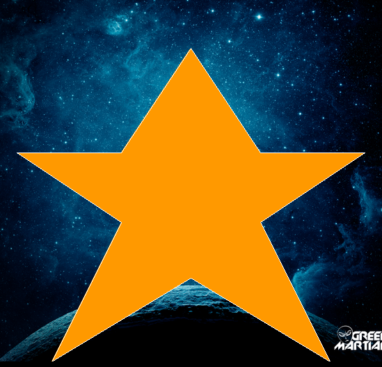

# Raster

A simple 2D Raster in C++ ([read the docs](https://greati.github.io/raster/doxygen/html/index.html)).



## Features:

* [x] Points
* [ ] Lines
    * [x] DDA (thickness 1)
    * [x] Bresenham (thickness 1)
    * [-] Wu (thickness 1) - experimental, working only for black backgrounds
    * [-] DDA (thickness N) - experimental, problems with vertical and horizontal
    * [ ] Bresenham (thickness N)
    * [ ] Wu (thickness N)
* [ ] Circles
    * [x] Midpoint (thickness 1)
    * [x] Midpoint (thickness N)
    * [x] Wu (thickness 1) - experimental, working only for black backgrounds
    * [ ] Wu (thickness N)
* [x] Circle arcs
    * [x] Midpoint (thickness 1)
    * [x] Midpoint (thickness N)
* [ ] Ellipsis
    * [x] Wu (thickness 1)
    * [ ] Wu (thickness N)
* [ ] Fills
    * [-] Polygon interior finder (architecture done, but still not working)
    * [x] Circle interior finder - takes the center
    * [x] Ellipsis interior finder - takes the center
    * [x] Polygon scan-line
    * [x] Flood fill
    * [x] Boundary fill
* [ ] Antialiasing
    * [-] Xialing-Wu - experimental, only for black backgrounds
    * [x] Convolution with gamma correction

## Build

```
mkdir build
cd build
cmake ../sources .
cmake --build .
```

## Run

```
cd build
./raster <your yml description> <path to destination>
```

## Test

```
make test
```

# YAML description

You describe the scenes using YAML. Below is a guide about doing that for raster.

## General structure

An YAML scene description for the Raster is made of two main sections: **settings** and
**scene**, the former being optional:

```yaml
settings:
    colors:
        #...
    points:
        #...
    strokes:
        #...
    fills:
        #...
scene:
    width: #...
    height: #...
    background: #...
    objects:
        your_line:
            type: line
            #...
        your_circle:
            type: circle
            #...
        your_ellipse:
            type: ellipsis
            #...
        your_polygon:
            type: polygon
            #...
        your_polyline:
            type: polyline
            #...
    # more attributes...
```

The next sections details what you can use as attributes in your description.

## Common attributes

These are attributes that can appear in some of the object descriptions
of the next section. They are described in the same way for any objects.

### Stroke

The contour of the object.

#### Attributes
*  **color**: stroke color
*  *thickness*: stroke thickness
*  *antialiased*: enable/disable antialiasing
*  *drawer*: algorithm used to draw

Example: 
```yaml
stroke:
    color: [255, 255, 255]
    thickness: 2
    antialiased: True
    drawer: bresenham [dda | wu]
```

### Fill

Example:
```yaml
fill:
    color: [255, 255, 255]
    filler: scanline [flood | boundary]
```
## Settings

### Color palette

You can define your color pallette in the settings section.

#### Example

```yaml
settings:
    colors:
        your_color1: [100, 200, 100]
        your_color2: [2, 2, 2]
scene:
    # scene description...
```

### Points

You can define a list of named points to be referenced later in your object
definitions.

#### Example

```yaml
settings:
    points:
        A: [10, 10]
        B: [400,400]
scene:
    width: 800
    height: 600
    background: [255, 255, 255]
    global_aa: True
    objects:
        your_line:
            type: line
            start: A
            end: B
            # more attributes...
```

### Strokes

You can also define your own reusable stroke styles.

#### Example

```yaml
settings:
    strokes:
        my_stroke:
             #stroke attributes
scene:
    width: 800
    height: 600
    background: [255, 255, 255]
    global_aa: True
    objects:
        your_line:
            type: line
            stroke: my_stroke
            # more attributes...
```

### Fills

You can also define your own reusable fill styles.

#### Example

```yaml
settings:
    fills:
        my_fill:
             #fill attributes
scene:
    width: 800
    height: 600
    background: [255, 255, 255]
    global_aa: True
    objects:
        your_line:
            type: line
            fill: my_fill
            # more attributes...
```

## Scene

### Attributes

*  **height**: integer number of lines in the resulting image
*  **width**: integer number of columns in the resulting image
*  **background**: background color/PNG to be set at the beginning of the rendering.
If PNG, specify the absolute path
*  **objects**: dictionary of objects to be drawn.
*  **global_aa**: enables global antialiasing

#### Example

```yaml
scene:
    width: 800
    height: 600
    background: [255, 255, 255]
    global_aa: True
    objects:
        your_object1: #...
        your_object2: #... 
```

## Objects

Each object must be written inside the **objects** dictionary in the scene description.

### Point

#### Attributes
*  **type**: point
*  **coords**: [row, col] of the point
*  **color**: color of the pixel

##### Example
```yaml
scene:
    # scene attributes
    objects:
        your_point:
            type: point
            coords: [10, 10]
            color: [255, 0, 255]
```

### Lines
#### Attributes

*  **type**: line
*  **start**: start point
*  **end**: end point
*  **stroke**: line's stroke

#### Example
```yaml
scene:
    # scene attributes
    objects:
        your_line:
            type: line
            start: [10, 10]
            end: [50, 50]
            stroke:
                color: [255, 255, 255]
                thickness: 2
                antialiasing: true
```

#### Observations
*  if thickness is 1 and AA is disabled, you can choose between the three drawers
*  if thickness is 1 and AA is enabled, Wu will be used as drawer necessarily
*  if thickness > 1 and AA is disabled, DDA will be used
*  if thickness > 1 and AA is enabled, DDA with Wu will be used

### Polyline

#### Attributes
*  **type**: polyline
*  **vertices**: a list of vertices of the polyline
*  **stroke**: line's stroke

#### Example
```yaml
scene:
    # scene attributes
    objects:
        your_polyline:
            type: polyline
            vertices:
                - [10, 10]
                - [10, 40]
                - [30, 30]
            stroke:
                color: [255, 255, 255]
                thickness: 2
                antialiasing: true
```
#### Observations

The drawing follows the same rules for lines.

### Polygon

#### Attributes
*  **type**: polygon
*  **vertices**: a list of vertices of the polyline
*  **stroke**: line's stroke
*  **drawer**: the drawer of the lines
*  *filler*: the algorithm to fill the polygon ("scanline", "flood", "boundary"),
optionally with an interior point indication
*  *interior*: interior points to be used in a filler

#### Example
```yaml
scene:
    # scene attributes
    objects:
        your_polygon:
            type: polygon
            vertices:
                - [10, 10]
                - [10, 40]
                - [30, 30]
            stroke:
                color: [255, 255, 255]
                thickness: 1
                antialiasing: false
            fill:
                color: [255, 0, 0]
                filler: scanline
```
#### Observations

*  The drawing for edges follows the same rules for lines.
*  if thickness is 1 and AA is disabled, you can choose between the three fillers
*  if thickness is 1 and AA is enabled, you can choose between the flood or boundary
*  if thickness > 1, you can choose between the flood or boundary
*  if no interior point is given, raster will try to find it (not yet implemented)

### Circle

#### Attributes
*  **type**: circle
*  **center**: [row, col] of the center
*  **radius**: circle radius
*  **stroke**: line's stroke
*  *arc*: pair of angles, define the aperture, allowing to create arcs (incomplete circles)
*  *fill*: the algorithm to fill the circle ("scanline", "flood", "boundary")

#### Example
```yaml
scene:
    # scene attributes
    objects:
        your_circle:
            type: circle
            center: [20, 30]
            radius: 10
            stroke:
                color: [255, 255, 255]
                thickness: 1
                antialiasing: false
            fill:
                color: [255, 0, 0]
                filler: scanline
            
```
#### Observations

*  if thickness is 1 and AA is disabled, midpoint algorithm will be used
*  if thickness is 1 and AA is enabled, Wu will be used
*  if thickness > 1, midpoint will be used
*  if thickness > 1 and AA is enabled: *unavailable*

### Ellipse

#### Attributes
*  **type**: ellipse
*  **center**: [row, col] of the center
*  **radius_v**: vertical radius
*  **radius_h**: horizontal radius
*  **stroke**: line's stroke
*  *fill*: the algorithm to fill the ellipse ("scanline", "flood", "boundary")

#### Example
```yaml
scene:
    # scene attributes
    objects:
        your_ellipse:
            type: ellipse
            center: [20, 30]
            radius_v: 10
            radius_h: 20
            stroke:
                color: [255, 255, 255]
                thickness: 1
                antialiasing: false
            fill:
                color: [255, 0, 0]
                filler: scanline
```
#### Observations
*  if thickness is 1 and AA is enabled, Wu will be used
*  if thickness is 1 and AA is disabled: *unavailable*
*  if thickness > 1: *unavailable*

### Arcs

Use the *arc* attribute of circles to draw arcs. Angle (degrees) range starts at 
the right of the unit circle and grows clockwise.

```yaml
scene:
    # scene attributes
    objects:
        your_circle:
            type: circle
            center: [20, 30]
            radius: 10
            arc: [0, 220]
            stroke:
                color: [255, 255, 255]
                thickness: 1
                antialiasing: false
            fill:
                color: [255, 0, 0]
                filler: scanline
            
```

